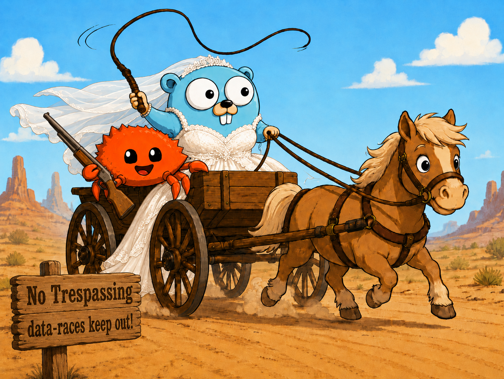

Gopher in a gown, on patrol, pulled by a pony, with a crab sidekick.
(No shotgun wedding jokes, please :)

# Go + Ownership = Gown

Author: Jason E. Aten, Ph.D.

First release: 2026 June 5

The one line summary of Gown is:
channel sends can now enforce at compile time the former 
"convention only" transfer of ownership.

Welcome to the Gown tutorial. As a command line
pre-processor, Gown is a Go source-to-source 
translator that allows the Go developer
to describe pointer ownership and data immutability. 

Gown is backwards compatible with existing Go. 
Gown allows you to incrementally add stronger ownership
and data-race freedom to an existing Go codebase.

Since Gown catches data-races at compile time by
static analysis, it provides stronger protection against 
data races than the (valuable but incomplete) detection offered by
the Go race detector. We say stronger rather than
absolute because legacy (unannotated) code and `\unsafe`
code can block Gown's proof of data-race freedom.
However if you annotate all your code and avoid all `\unsafe`
usage, then Gown -- like Pony -- gives you a guarantee 
of data-race freedom at compile time.

## status

The design and initial implementation is done. We now need vigorous testing
and feedback from actual usage to catch implementation errors and
to address any sharp edges. 

We did a formal machine checked proof of correctness, so we are
fairly confident the design is sound. There may still be implementation
bugs that do not catch all data races. 

Call for testing: Help us polish and refine Gown by trying it out. File
bug report issues to help us improve.

## installation

go install github.com/glycerine/gown/cmd/gown@latest

Use: `gown <path to package to check>`

Example: `cd gown/vectors/ex3 && gown . && go run .`

## overview

Inspired a little by Rust, and alot by Pony's 
ownership system, Gown is a pre-processor 
for Go source that statically detects use-after-move
data-races at compile time. 

Gown is much simpler than Pony. Gown is also 
vastly simpler than Rust. Rust requires lifetime
annotations at times, Gown does not. Pony has six ownership
reference capabilities. Gown has only four. And
we call them ownerstamps.

Terminology: we use the term "ownerstamp" to evoke the 
traditional use of postage stamps on the outside of 
an envelope (pointer). Depending on the destination 
(country/goroutine/function), you need different stamps.
Moreover the stamp can change while the envelope stays the same.
Ownerstamp is easier to say out loud, and it means we are talking 
about Gown specifically.

The most common data race in my own Go programs is simultaneous access after
I have sent data to another goroutine over a channel. 

Gown aims to catch that mistake early, long before runtime.

To do this Gown analyzes the SSA form of a Go package. It
will conservatively reject programs that it cannot prove
correct. Thus some re-arrangement of pointer manipulation,
aiming for provable safety, may be required, particularly
after a select{} statement that sends an `\iso` pointer. 
To my thinking, this is a small inconvenience in exchange for data-race freedom.

In detail: since the select case is chosen at runtime rather than
known at compile time, Gown's static analysis must assume 
that after a select statement an `\iso` pointer could have
been sent away. After the select statement, it is therefore
illegal to reference the \iso, even if it has not been
sent. This may prompt you to \clone the pointer before
possibly sending it. Fortunately, this is almost always
the correct response/approach/habit/recommended practice for
avoiding data races. Gown just reminds you to do it,
and complains if you forget.

## introduction

In Gown there are only four core ownerstamps
on pointers: `\iso` for single-owner (isolated) mutable data, `\imm` for
immutable data, `\mub` for mutable borrow, and `\rob` for read-only borrowed data.

An ownerstamp is Gown's term of art for an ownership annotation: a small mark on
a Go type that says who may own, mutate, borrow, or share the pointed-to value.
There are also some helpers like `\new` and `\clone` which create new `\iso`
pointers that we will get to later in this tutorial. For now we concentrate
on the ownerstamp definitions.

Each ownerstamp tells the Gown checker what kind of 
access a piece of code has to a value: unique ownership (`\iso`),
local mutation (`\mub`), local read-only access (`\rob`), or 
globally, deeply immutable and thus always safe for sharing (`\imm`)

As a pre-processor, Gown aims to check for data-races before Go
compilation starts. You write `.gown` files, Gown checks them, 
and then Gown emits ordinary `.go` files with the annotations erased.

This tutorial is an introduction and starting point. For the 
full specification, see `gown-spec.md`. The human readable proofs
of soundness are in the theory-proof.md and theory-proof-gemini-v2.md
files, which are backed by `Gown.lean`, a machine-checked formal proof.

### the core idea

In ordinary Go, any pointer can be copied and shared with any goroutine.
Thus there can be multiple aliases of the same pointer outstanding at 
once. If you want to be sure only a single goroutine is accessing
that pointer, the compiler does not help you. In regular Go, one goroutine can be
mutating the pointed-to value, while another is reading it. We
want to be able to forbid this and prove some memory can only be
accessed by one goroutine, the current owner; that there are no aliases.

>  "There can be only one." 
>     -- with apologies to Connor MacLeod from the film Highlander, 1986

Gown lets you write `\iso` to rule out all other aliases. The goroutine
with an `\iso` pointer knows it has exclusive access; there are no other 
copies of that pointer. The goroutine owns the pointed to value until
it gives the pointer away. 

As a running example, suppose we pass around a *Ticket describing a job and the progress made on the job so far.

```go
type Ticket struct {
    // ... various job description and progress/
    // state fields would follow
    Data []byte
}
```

If a pointer has type `\iso *Ticket`, then there is only one owner. If a pointer
has type `\imm *Ticket`, then its value is deeply immutable and always safe to share across goroutines. If a
pointer has type `\mub *Ticket` or `\rob *Ticket`, then it is a local borrow that
must not cross goroutine boundaries.

The four core ownerstamps used to annotate pointers are:

| Ownerstamp | Name | Mutable? | Sendable across goroutines? | Main idea |
| --- | --- | --- | --- | --- |
| `\iso` | isolated | yes | yes, by move | one unique owner |
| `\mub` | mutable borrow | yes | no | temporary local mutation |
| `\rob` | read-only borrow | no | no | temporary local reading |
| `\imm` | immutable | no | yes, by sharing | safe to share freely |

## ownerstamp syntax

Ownerstamps, our ownership annotations, appear before the `*` in pointer types:

```go
func Take(b \iso *Ticket) {}
func Mutate(b \mub *Ticket) {}
func Inspect(b \rob *Ticket) {}
func Share(b \imm *Ticket) {}
```

They can appear on function parameters, function return types, struct fields,
interface methods, channel element types, and explicit local variable
declarations.

Local variables are usually inferred from the right-hand side:

```go
b := \new(Ticket{})
```

Here `b` is inferred as `\iso *Ticket`.

All Gown ownerstamps begin with `\`. If an ownerstamp accidentally leaks into
generated Go, the Go compiler will reject it as illegal text before lexing begins. That makes ownerstamp leakage fail fast instead of silently changing the program.

## `\iso`: isolated ownership

Use `\iso` when one part of the program owns a mutable value uniquely.

An `\iso` value may be read and written; but only by the owning goroutine. 
It may also be sent to another goroutine, but sending it is a move: 
after the move, the sender no longer owns the value.

```go
type Ticket struct {
    Data []byte
}

func Take(b \iso *Ticket) {
    b.Data = append(b.Data, 1)
}

func main() {
    b := \new(Ticket{})
    Take(b)

    // Error: b was moved into Take.
    _ = b
}
```

Passing an `\iso` to a parameter declared `\iso` transfers ownership to the
callee. The caller must stop using the old variable.

### rebinding after a move

A moved variable can be used again after it is assigned a fresh valid value.

```go
func main() {
    b := \new(Ticket{})
    Take(b)

    b = \new(Ticket{})
    b.Data = append(b.Data, 2) // ok: b has been rebound
}
```

This isn't a great idea, but rebinding is a common idiom 
in today's Go code. Hence Gown does not make it illegal.
This facilitates adoption of Gown.

The important rule is that the new value must itself be a
valid `\iso` value.

### assignment moves ownership

Assigning one `\iso` variable to another is also a move.

```go
func main() {
    a := \new(Ticket{})
    b := a

    b.Data = append(b.Data, 1) // ok

    // Error: a was moved into b.
    _ = a
}
```

### sending `\iso` on a channel

An `\iso` value can be sent across a channel whose element type is `\iso`.

```go
func main() {
    ch := make(chan \iso *Ticket, 1)

    b := \new(Ticket{})
    ch <- b

    // Error: b was moved into the channel.
    _ = b
}
```

The receiver becomes the new owner:

```go
func worker(ch chan \iso *Ticket) {
    b := <-ch
    b.Data = append(b.Data, 1)
    Take(b)
}
```

## `\mub`: mutable borrow

Use `\mub` when a function needs to mutate a value temporarily, but should not
take ownership of it. For example, a function that receives a \mub parameter is forbidden from sending it to another goroutine. In this example, AppendByte can mutate b, but not give it away. We know after AppendByte returns that main still has ownership of b. AppendBytes cannot store the pointer for later. AppendBytes cannot \freeze the pointer making it immutable.

```go
func AppendByte(b \mub *Ticket, x byte) {
    b.Data = append(b.Data, x)
}

func main() {
    b := \new(Ticket{})

    AppendByte(b, 7)
    AppendByte(b, 8)

    // Still ok: AppendByte only borrowed b.
    Take(b)
}
```

The caller keeps its `\iso` after passing it to a `\mub` parameter. Gown inserts
an implicit mutable borrow for the duration of the call.

You can also create an explicit named mutable borrow:

```go
func main() {
    b := \new(Ticket{})

    mb := \mub(b)
    mb.Data = append(mb.Data, 1)
    mb.Data = append(mb.Data, 2)

    // Once mb is no longer live, b can be moved.
    Take(b)
}
```

`\mub` is goroutine-local. It cannot be sent over a channel.

```go
func Bad(ch chan \iso *Ticket, b \mub *Ticket) {
    ch <- b // error: mutable borrows are not sendable
}
```

Use `\mub` for ordinary local mutation. It is the annotation that most closely
matches normal single-goroutine Go pointer use.

## `\rob`: read-only borrow

Use `\rob` when a function should be allowed to inspect a value but not mutate
it. It allows you to write functions that can process any kind of data, be it immutable or mutable or isolated.

```go
func Len(b \rob *Ticket) int {
    return len(b.Data)
}

func main() {
    b := \new(Ticket{})

    n := Len(b)
    _ = n

    // Still ok: Len only borrowed b.
    Take(b)
}
```

The caller keeps its ownership. The read-only borrow lasts for the call.

A `\rob` value cannot be used to write:

```go
func Bad(b \rob *Ticket) {
    b.Data = nil // error: cannot write through a read-only borrow
}
```

You can create an explicit named read-only borrow when you want to use the
borrow across more than one expression:

```go
func main() {
    b := \new(Ticket{})

    rb := \rob(b)
    _ = len(rb.Data)
    _ = cap(rb.Data)

    Take(b)
}
```

`\rob` is also goroutine-local. It is read-only, but it is still a borrow, not
a shareable value. Use `\imm` when you want safe sharing across goroutines.

## `\imm`: deeply immutable (always sharable)

Use `\imm` when many parts of the program may share the same value, including
different goroutines, and none of them may mutate it.

An `\imm` value is deeply immutable: the object and the reachable object graph
behind it must not be mutated through the immutable reference.

You usually create `\imm` by freezing an `\iso`:

```go
func ReadOnlyLen(b \imm *Ticket) int {
    return len(b.Data)
}

func main() {
    b := \new(Ticket{})
    shared := \freeze(b)

    _ = ReadOnlyLen(shared)
    _ = ReadOnlyLen(shared) // ok: imm values can be reused

    // Error: b was consumed by freeze.
    _ = b
}
```

Unlike `\iso`, sending an `\imm` value does not consume it.

```go
func main() {
    ch := make(chan \imm *Ticket, 2)

    b := \new(Ticket{})
    shared := \freeze(b)

    ch <- shared
    ch <- shared // ok: immutable values are shareable

    _ = shared // still ok
}
```

Writes through `\imm` are rejected:

```go
func Bad(b \imm *Ticket) {
    b.Data = nil // error: cannot write through immutable data
}
```

## built-ins

Gown has a small set of built-in operations. They look like function calls, but
they are preprocessor constructs.

| Operation | Meaning | Output idea |
| --- | --- | --- |
| `\new(T{...})` | allocate a fresh isolated value | `&T{...}` |
| `\clone(x)` | call a trusted same-type `clone` method | `(x).clone()` |
| `\Clone(x)` | call a trusted same-type `Clone` method | `(x).Clone()` |
| `\freeze(x)` | consume `\iso`, produce `\imm` | assignment plus consumed source |
| `\mub(x)` | make an explicit mutable borrow | `x` |
| `\rob(x)` | make an explicit read-only borrow | `x` |
| `\swap(a, b)` | exchange two `\iso` owner cells | `a, b = b, a` |
| `\unsafe(x)` | cross an unchecked boundary explicitly | `x` |
| `\restore`   | like Pony's `recover`: temporary rule suspension | see restore-spec.md |
| `\\\\observer` | designate access (e.g. \rob fmt.Printf) as safe | avoids changing stdlib |

### `\new`

Use `\new` to create a fresh `\iso` pointer from a struct literal.

```go
func main() {
    b := \new(Ticket{Data: []byte{1, 2, 3}})
    Take(b)
}
```

### `\clone`

Use `\clone` when you want a fresh isolated copy while keeping the original
available. 

For a value of static type `T`, `T` must have:

```go
clone() T
```

For a value of static type `*T`, `*T` must have:

```go
clone() *T
```

Example:

```go
func (b *Ticket) clone() *Ticket {
    cp := *b
    cp.Data = append([]byte{}, b.Data...)
    return &cp
}

func main() {
    template := \new(Ticket{Data: []byte{1, 2, 3}})

    copy1 := \clone(template)
    copy2 := \clone(template)

    Take(copy1)
    Take(copy2)

    // template was not consumed by clone.
    Take(template)
}
```

Gown trusts `clone` to return an independent value. The checker verifies the
method shape, but it cannot prove that the method body performed a deep copy.

The uppercase `\Clone` version is identical except that it calls
the exported Clone() method instead.

### `\freeze`

Use `\freeze` when you are done mutating an isolated value and want to share it.

```go
func Publish(ch chan \imm *Ticket, b \iso *Ticket) {
    shared := \freeze(b)
    ch <- shared
    ch <- shared
}
```

Freezing consumes the original `\iso`.

### `\swap`

Use `\swap` when you need to exchange two isolated owner cells without treating
either cell as an untracked destination.

```go
type Wheel struct{}

type Bicycle struct {
    Front \iso *Wheel
}

func main() {
    b := \new(Bicycle{Front: &Wheel{}})
    var front \iso *Wheel

    \swap(front, b.Front)
}
```

Both arguments must be assignable local or field places, both must have effective
ownerstamp `\iso`, and their static Go types must be identical. Gown emits Go's
ordinary simultaneous assignment:

```go
front, b.Front = b.Front, front
```

Root/field overlap is allowed. For example, `\swap(n.Next, n)` is governed by
the same Go assignment evaluation order as the emitted code.

### `\unsafe`

Use `\unsafe` only at an explicit checked-to-unchecked boundary, such as a call
to ordinary Go code that Gown cannot analyze. Once a value has an ownerstamp,
Gown will not let it silently become plain Go again.

```go
func LegacyUse(b *Ticket) {
    // ordinary Go code
}

func main() {
    b := \new(Ticket{})

    LegacyUse(\unsafe(b))

    // Later ownerstamp operations on b may be rejected, because the checker no
    // longer has a complete proof of what happened beyond the unsafe boundary.
}
```

`\unsafe` is intentionally visible and searchable. It is the place where the
programmer says, "I know something the checker cannot verify."

See also `\\\\observer`

## `\\\\observer`

For example, the `\\\\observer fmt.Printf` stand alone comment is used to designate the 
debug helpers like fmt.Printf are doing read-only borrows and should not cause alarm.

The observer annotation turns off strict checking on a per-function basis. This is a practical
affordance to avoid having to annotate the declarations of the standard "fmt"
library.

## function patterns

Lets compare the same API shape under different annotations.

```go
func Own(b \iso *Ticket) {
    // Takes ownership. Caller loses b.
}

func Mutate(b \mub *Ticket) {
    // Temporarily mutates. Caller keeps b.
    b.Data = append(b.Data, 1)
}

func Inspect(b \rob *Ticket) int {
    // Temporarily reads. Caller keeps b.
    return len(b.Data)
}

func Share(b \imm *Ticket) int {
    // Reads a shareable immutable value.
    return len(b.Data)
}
```

At a call site:

```go
func main() {
    b := \new(Ticket{})

    Mutate(b)  // implicit \mub borrow
    Inspect(b) // implicit \rob borrow

    frozen := \freeze(b)
    Share(frozen)
    Share(frozen)
}
```

The distinctions:

| Callee wants | Caller effect |
| --- | --- |
| `\iso` | caller gives up ownership |
| `\mub` | caller lends mutable access temporarily |
| `\rob` | caller lends read-only access temporarily |
| `\imm` | caller shares immutable access |

## channel patterns

Channels can either move (transfer) `\iso` poitners, or share `\imm` immutable ones.
The local-only `\mub` and `\rob` borrowed pointers can never be sent on a channel.

### Ownership Transfer Channel

Use `chan \iso *T` when each item has one owner at a time.

```go
func producer(ch chan \iso *Ticket) {
    b := \new(Ticket{})
    ch <- b

    // b is gone here.
}

func consumer(ch chan \iso *Ticket) {
    b := <-ch
    b.Data = append(b.Data, 1)
    Take(b)
}
```

### immutable broadcast channel

Use `chan \imm *T` when many receivers may safely share the same data.

```go
func publish(ch chan \imm *Ticket) {
    b := \new(Ticket{Data: []byte{1, 2, 3}})
    shared := \freeze(b)

    ch <- shared
    ch <- shared
    ch <- shared
}
```

### sending a clone

When you want to keep a local value but send a fresh owned copy, clone before
sending.

```go
func publishCopies(ch chan \iso *Ticket, template \rob *Ticket) {
    ch <- \clone(template)
    ch <- \clone(template)
}
```

The channel receives fresh `\iso` values. The template is not consumed.

### stable reply channels (composition and projection)

In the common Ticket (promise) pattern, an owned value needs 
to carry a reply channel with it. The worker gets
ownership of the value, does some work, and then sends the value back.

The reply channel field should be declared `\imm`. This allows
the original owner to still receive on it.

```go
type Ticket struct {
    Data string
    Done \imm chan \iso *Ticket
}

func NewTicket(data string) \iso *Ticket {
    return &Ticket{
        Data: data,
        Done: make(chan \iso *Ticket),
    }
}
```

The `\imm` annotation says the channel handle stored in `Done` is stable. The
field may be read even after the parent ticket has moved, because nobody is
allowed to replace the channel handle.

```go
func main(work chan \iso *Ticket) {
    t := NewTicket("demo")

    work <- t

    // t moved into work, but t.Done is a stable immutable field.
    t = <-t.Done

    println(t.Data)
}
```

Without `\imm`, this would be unsafe:

```go
type BadTicket struct {
    Done chan \iso *BadTicket
}
```

After `BadTicket` moves to another goroutine, the new owner could reassign
`Done` at the same time the old owner tries to read it. That would be a race on
the field slot. `\imm chan ...` prevents that by making the field slot
read-only (while the channel itself is always goroutine safe).

## struct fields

Struct fields may also carry ownerstamps.

```go
type Ticket struct {
    Input  \iso *Input
    Cfg    \imm *Config
    Done   \imm chan \iso *Ticket
}
```

If you own a `tkt \iso *Ticket`, then moving `tkt.Input` out directly is restricted:
moving from a field projection can leave the containing object partially moved.
The Gown checker will reject this.

In this situations, the three possible solutions are: use \swap, use \restore, 
or write a helper function that does a local borrow:

```go
func ReplaceInput(tkt \mub *Ticket, nextInput \iso *Input) {
    tkt.Input = nextInput
}
```

Summary:

- Put ownerstamps on fields that store tracked pointers.
- Read-only or immutable access through the outer object makes reachable fields
  read-only too.
- Use `\imm chan ...` for stable channel fields that must be read after the
  parent object moves.
- helper func with `\mub` borrows, `\restore`, and `\swap` assist in `\iso` maintenance.

## errors

Gown reports structured errors with codes.

| Code | Meaning | Common fix |
| --- | --- | --- |
| `GWN001` | used an `\iso` after it was moved or consumed | rebind it, clone before moving, or stop using the old variable |
| `GWN002` | a live borrow blocks a move or freeze | shorten the borrow lifetime |
| `GWN003` | tried to send `\mub` or `\rob` across a channel | send `\iso` or `\imm` instead |
| `GWN005` | wrote through `\rob` or `\imm` | use `\mub` or keep unique `\iso` ownership |
| `GWN008` | passed a tracked value to untracked Go | add annotations or use `\unsafe` deliberately |
| `GWN009` | erased a tracked value into an interface | avoid the interface boundary or use `\unsafe` deliberately |
| `GWN010` | invalid ownerstamp conversion, channel mismatch, or clone shape | adjust the ownerstamp or method signature |
| `GWN012` | tried to use a value as tracked after explicit `\unsafe` | keep it tracked or stop using it as ownerstamp-proven |

## a complete example

This example uses ownership transfer to issue tickets to a worker
goroutine.

The pattern of having an \imm channel field is useful. The worker
cannot accidentally change the reply channel that the supervisor
is expecting to hear back on. The supervisor (main) can
receive on the \imm channel tkt.done even though it gave away ownership
of the parent `\iso` ticket.

The `\\\\observer` line declares that fmt.Printf promises to
look but not modify its arguments. This is an ergonomic addition
to avoid having to annotate all logging/debug/dump helpers.

```go
package main

import (
    "fmt"
)

\\\\observer fmt.Printf

type bigTree struct {
    name string

    // Pretend this is the root of a big tree full of state.
    // We just skip showing all the other stuff.
    // ...
}

func (t *bigTree) clone() *bigTree {
   return &bigTree {
       name: t.name,
   }
}

type ticket struct {
    tree           \iso *bigTree
    outcome             string
    done \imm chan \iso *ticket
}

func (t *ticket) clone() *ticket {
    return &ticket{
        tree: t.tree.clone(),
        outcome: t.outcome,
        done: make(chan *ticket),
    }
}

func newTicket(name string) \iso *ticket {
    return &ticket{
        tree: &bigTree{
            name: name,
        },
        done: make(chan \iso *ticket),
    }
}

type worker struct {
    getJob chan \iso *ticket
    end    chan struct{}
}

func newWorker() *worker {
    return &worker{
        getJob: make(chan \iso *ticket),
        end:    make(chan struct{}),
    }
}

func (w *worker) runBackgrounWorkerGoro() {
    go func() {
        for {
            select {
            case tkt := <-w.getJob:
                fmt.Printf("processing tkt.tree.name: '%v'\n", tkt.tree.name)
                tkt.outcome = "ok"
                tkt.done <- tkt
                // even though we own tkt, it is still
                // illegal to change the \imm done field.
                // The submitter is depending on hearing 
                // back on that particular channel
                //tkt.done = nil // GWN005: cannot write through \imm value "tkt"
                //tkt.done = make(chan \iso *ticket) // ditto; same GWN005 error
            case <-w.end:
                return
            }
        }
    }()
}

// main "supervises" a worker goroutine, issuing a job tickets to it
// and waiting for the worker to send back the ticket on the done channel.
func main() {
    w := newWorker()
    w.runBackgrounWorkerGoro()
    defer close(w.end) // tell the worker to exit when we do.

    tkt := newTicket("ticket_0")

    demonstrateClone := false

    if demonstrateClone {
        tkt2 := \clone(tkt)
        w.getJob <- tkt2
        // still be legal to touch tkt now because we only cloned it.
        fmt.Printf("tkt is: '%#v'\n", \unsafe(tkt))
        // but it is illegal to touch tkt2 now, since the worker now owns it.
        //fmt.Printf("tkt2 is: '%#v'\n", tkt2)
        tkt = <-tkt2.done
    } else {
        w.getJob <- tkt
        // illegal to touch tkt now that we moved ownership to the worker.
        //fmt.Printf("tkt is: '%#v'\n", tkt)
        // except to read an \imm channel or rebind it:
        //tkt = <-tkt.done // okay
        // also okay:
        tkt3 := <-tkt.done 
        tkt = tkt3
    }

    fmt.Printf("tkt.tree.name = '%v'\n", tkt.tree.name)
    fmt.Printf("got <-tkt.done: tkt.outcome = '%v'\n", tkt.outcome)
}
```

## exercises

Try these changes in small `.gown` files:

1. Write a function that takes `\iso *Ticket` and prove to yourself that the
   caller cannot use the old variable afterward.
2. Change that function to take `\mub *Ticket` and observe that the caller keeps
   ownership.
3. Add a read-only helper with `\rob *Ticket`, then try to write through the
   parameter and see the checker reject it.
4. Freeze an `\iso *Ticket` into `\imm *Ticket`, send it twice on a channel, and
   confirm the sender still has the immutable value.
5. Add a valid `clone() *Ticket` method, then send `\clone(b)` while continuing
   to use `b`.
6. Try to send a `\mub *Ticket` on a channel and explain why Gown rejects it.
7. Add a `Done \imm chan \iso *Ticket` reply channel to a ticket type, send the
   ticket to a worker, and receive the ticket back from `Done`.

## quick reference

Use `\iso` when there is exactly one mutable owner.

Use `\mub` when code needs temporary local mutation without taking ownership.

Use `\rob` when code needs temporary local read-only access.

Use `\imm` when data should be deeply immutable and freely shareable.

Use `\imm chan \iso *T` when a struct field stores a stable reply channel whose
handle must be read after the parent value moves.

Use `\new` to create fresh isolated values.

Use `\clone` to make trusted fresh isolated copies.

Use `\freeze` to turn isolated mutable data into immutable shared data.

Use `\unsafe` only when deliberately crossing into unchecked Go code.

Use `\swap`, `\restore`, or a local `\mub` borrow in a helper function
to manage related `\iso` pointers.

## gownfmt

Running make (the default `all` target of the gown/Makefile) also 
installs a version of `gofmt` called `gownfmt` (see cmd/gownfmt) that allows 
standard formating of Gown-annotated files while allowing and preserving
the Gown annotations. 

Regular `gofmt` cannot handle .gown files. This was intentional. The
design of the annotations was intentionally unparsable by standard
Go tooling to insure no Gown ownerstamps are missed during processing. 

Since `gownfmt` can also process regular .go files, it can fully
replace `gofmt` in Gown projects.

----------
Gown is Copyright (C) 2026, Jason E. Aten, Ph.D. All rights reserved.

License: BSD 3-clause license, same as Go. See the LICENSE file.

The Go gopher was designed by Renee French. (http://reneefrench.blogspot.com/)
The design is licensed under the Creative Commons 4.0 Attributions license.
Read this article for more details: https://go.dev/blog/gopher

Ferris the crab, unofficial mascot for Rust, per https://www.rustacean.net/ is:
"To the extent possible under law, Karen Rustad Tölva has waived all copyright and related or neighboring rights to Ferris the Rustacean. This work is published from: United States."

